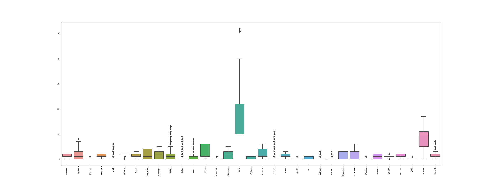
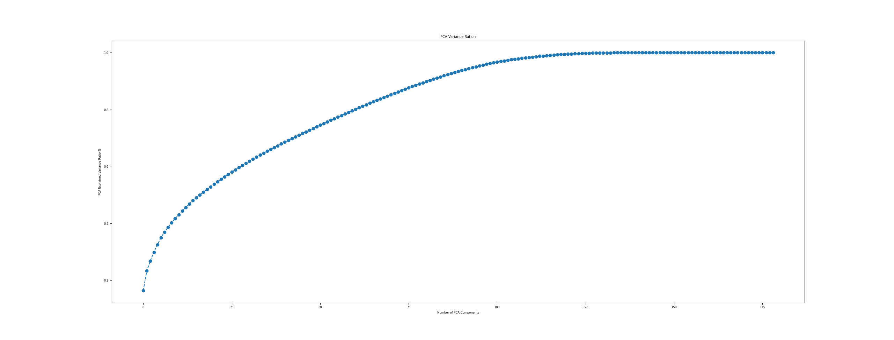
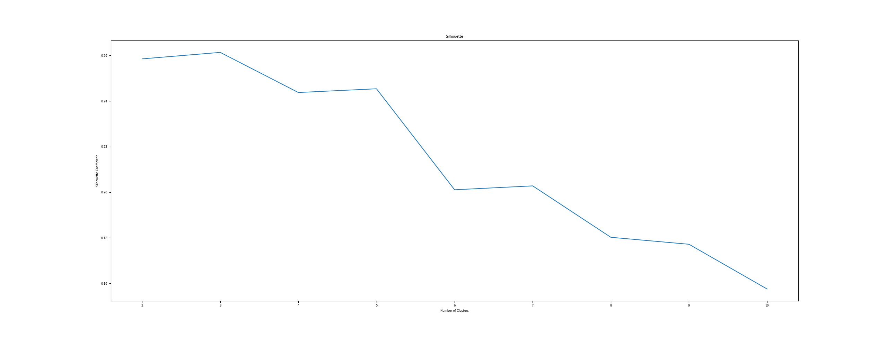
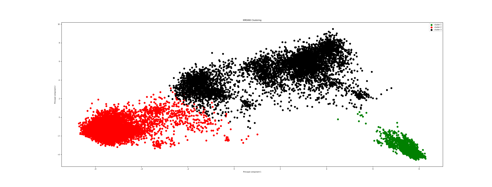
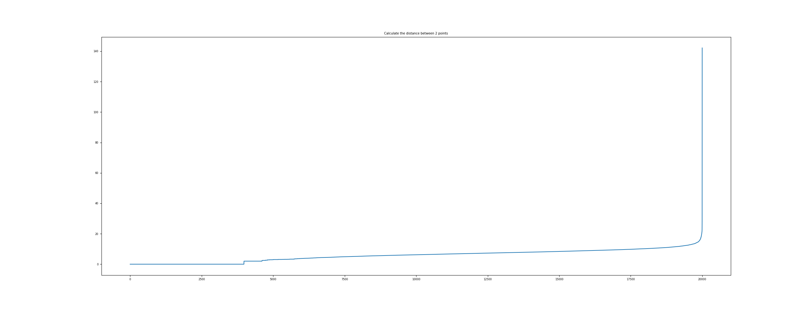

## Data description

The USCensus19910raw data set, it is a multivariate dataset which consist of 69 categorical feature and 2458285 rows.
https://archive.ics.uci.edu/ml/datasets/US+Census+Data+%281990%29

| Dataset     | Instances   | Features|
| ------------|:-----------:| -------:|
| Original    | 2.458.285   | 69      |

TODO: missing values
Unique Values: 398
### Box Plots for every feature

## Data preprocessing

Another observation from the graph concerns the domains of the two variables Age and Income. We understand that the domain for Age is from around 20 to 70, whereas for Income it is from around 40,000 to over 300,000. Which points to a vast difference between the range of these values. Therefore, we must incorporate an important step in our analysis, and we must first standardize our data. Standardization is an important part of data preprocessing, which is why we’ve devoted the entire next paragraph precisely to this topic.

Citizenship, Column Name: iCitizen
| Initial | Converted |
| --- | --- |
| 0: Born in the U.S. | 0: Born in US |
| 1: Born in Puerto Rico, Guam, and Outlying| 1: Not Born in US |
| 2: Born Abroad of American Parents | |
| 3: U.S. Citizen by Naturalization| |
| 4: Not a Citizen of the U.s| |

Class of Worker, Column Name: iClass
| Initial | Converted |
| --- | --- |
| 0: N/a Less Than 16 Yrs. Old/unemp. Who Nev| 0: Employed |
| 1: Emp. of a Private for Profit Company or| 1: not Employed|
| 2: Emp. of a Private Not for Profit, Tax Ex| |
| 3: Local Gov. Emp. City, County, Etc.| |
| 4: State Gov. Emp.| |
| 5: Fed. Gov. Emp.| |
| 6: Self Emp. in Own Not Incorp.d Business,| |
| 7: Self Emp. in Own Incorp.d Business, Prof| |
| 8: Working Without Pay in Fam. Bus. or Farm| |
| 9: Unemp., Last Worked in 1984 or Earlier| |
 
Ability to Speak English, Column Name: iEnglish 
| Initial | Converted |
| --- | --- |
| 0:N/a Less Than 5 Yrs. Old/speaks Only Eng| 0: Not Speak English |
| 1:Very Well| 1: Speak English |
| 2:Well| |
| 3:Not Well| |
| 4:Not At All| |

Employment Stat. of Parents, Column Name: iRemplpar
| Initial | Converted |
| --- | --- |
| 000: N/a Not Own Child of Hshldr., and Not Ch | 0: Both Parents Works |
| 111: Both Parents At Work 35 or More Hrs. | 1: Only Father Works |
| 112: Father Only At Work 35 or More Hrs. | 2: Only Mather Works |
| 113: Mother Only At Work 35 or More Hrs. | 3: Neither Parent Works |
| 114: Neither Parent At Work 35 or More Hrs. | |
| 121: Father At Work 35 or More Hrs. | |
| 122: Father Not At Work 35 or More Hrs. | |
| 133: Mother At Work 35 or More Hrs. | |
| 134: Mother Not At Work 35 or More Hrs. | |
| 141: Neither Parent in Labor Force | |
| 211: Father At Work 35 or More Hrs. | |
| 212: Father Not At Work 35 or More Hrs. | |
| 213: Father Not in Labor Force | |
| 221: Mother At Work 35 or More Hrs. | |
| 222: Mother Not At Work 35 or More Hrs. | |
| 223: Mother Not in Labor Force | |

Temp. Absence From Work , Column Name: iTmpabsnt
| Initial | Converted |
| --- | --- |
| Temp. Absence From Work |  |
| 0: N/a Less Than 16 Yrs. Old/at Work/did No | 0: N/a Less Than 16 Yrs. Old/at Work/did No |
| 1: Yes, on Layoff | 1: Yes |
| 2: Yes, on Vacation, Temp. Illness, Labor D | 2: No |
| 3: No | |

Rel. or Not Related or Grp. Qtrs., Column Name: iRelat1
| Initial | Converted |
| --- | --- |
| 00 |Hshldr. | 0: Relative|
| 01 |Husband/wife | 1: Not Relative |
| 02 |Son/daughter | |
| 03 |Stepson/stepdaughter | |
| 04 |Brother/sister | |
| 05 |Father/mother | |
| 06 |Grandchild | |
| 07 |Other Rel. | |
| 08 |Roomer/boarder/foster Child | |
| 09 |Housemate/roommate | |
| 10 |Unmarried Partner | |
| 11 |Other Nonrel. | |
| 12 |Instit. Person | |
| 13 |Other Pers. in Grp. Qtrs. | |

No. of Chld. Ever Born, Column Name: iFertil
| Initial | Converted |
| --- | --- |
| 00:N/a Less Than 15 Yrs./male | 0: No Chld. |
| 01:No Chld. | 1: 2-4 Child |
| 02:1 Child | 2: 5-13 Having many Child |
| 03:2 Chld. | |
| 04:3 Chld. | |
| 05:4 Chld. | |
| 06:5 Chld. | |
| 07:6 Chld. | |
| 08:7 Chld. | |
| 09:8 Chld. | |
| 10:9 Chld. | |
| 11:10 Chld. | |
| 12:11 Chld. | |
| 13:12 or More Chld. | |

Ed. Attainment, Column Name: iYearsch
| Initial | Converted |
| --- | --- |
| 00: N/a Less Than 3 Yrs. Old | 0: No School Completed |
| 01: No School Completed | 1:Median Education |
| 02: Nursery School | 2:High Education |
| 03: Kindergarten | |
| 04: 1st, 2nd, 3rd, or 4th Grade | |
| 05: 5th, 6th, 7th, or 8th Grade | |
| 06: 9th Grade | |
| 07: 10th Grade | |
| 08: 11th Grade | |
| 09: 12th Grade, No Diploma | |
| 10: High School Graduate, Diploma or Ged | |
| 11: Some Coll., But No Degree | |
| 12: Associate Degree in Coll., Occupational | |
| 13: Associate Degree in Coll., Academic Prog | |
| 14: Bachelors Degree | |
| 15: Masters Degree | |
| 16: Professional Degree | |
| 17: Doctorate Degree | |

Married, Spouse Present/spouse Absent, Column Name: iRspouse
| Initial | Converted |
| --- | --- |
| 0: N/a Less Than 15 Yrs. Old | 0: No |
| 1: Now Married, Spouse Present | 1: Yes |
| 2: Now Married, Spouse Absent | |
| 3: Widowed | |
| 4: Divorced | |
| 5: Separated | |
| 6: Never Married | |

Means of Transportation to Work , Column Name: iMeans
| Initial | Converted |
| --- | --- |
| 00: N/a Not a Worker Not in the Labor Force | 0: Not|
| 01: Car, Truck, or Van | 1: Public Transportation|
| 02: Bus or Trolley Bus | 2: By own|
| 03: Streetcar or Trolley Car | 3: Worked At Home|
| 04: Subway or Elevated | 4: Other Method|
| 05: Railroad | |
| 06: Ferryboat | |
| 07: Taxicab | |
| 08: Motorcycle | |
| 09: Bicycle | |
| 10: Walked | |
| 11: Worked At Home | |
| 12: Other Method | |

Military Srvc., Column Name: iMilitary
| Initial | Converted |
| --- | --- |
| 0:N/a Less Than 16 Yrs. Old| 0: No service|
| 1:Yes, Now on Active Duty| 1: Service|
| 2:Yes, on Active Duty in Past, But Not Now| |
| 3:Yes, Srvc. in Reserves or Nat. Guard Onl| |
| 4:No Srvc.| |

Language Other Than English At Home, Column Name: iLang1
| Initial | Converted |
| --- | --- |
| 0:N/a Less Than 5 Yrs. Old | 0: No |
| 1:Yes, Speaks Another Language | 1: Yes|
| 2:No, Speaks Only English | |

Mobility Stat. Lived Here on April 1, 19, Column Name: iMobility
| Initial | Converted |
| --- | --- |
| 0:N/a Less Than 5 Yrs. Old | 0: No |
| 1:Yes Same House Nonmovers |  1: Yes |
| 2:No, Different House Movers | |

No. of Chld. Ever Born, Column Name: iFertil
| Initial | Converted |
| --- | --- |
| 00:N/a Less Than 15 Yrs./male | 0: No |
| 01:No Chld. | 1: 2-4|
| 02:1 Child | 2: having many children 5-13|
| 03:2 Chld. | |
| 04:3 Chld. | |
| 05:4 Chld. | |
| 06:5 Chld. | |
| 07:6 Chld. | |
| 08:7 Chld. | |
| 09:8 Chld. | |
| 10:9 Chld. | |
| 11:10 Chld. | |
| 12:11 Chld. | |
| 13:12 or More Chld. | |

Married, Spouse Present/spouse Absent, Column Name: iRspouse
| Initial | Converted |
| --- | --- |
|0:N/a Less Than 15 Yrs. Old | 0: No|
|1:Now Married, Spouse Present | 1: Yes |
|2:Now Married, Spouse Absent | |
|3:Widowed | |
|4:Divorced | |
|5:Separated | |
|6:Never Married | |

Personal Care Limitation, Column Name: iPerscare
| Initial | Converted |
| --- | --- |
|0:N/a Less Than 15 Yrs./instit. Person, an | 0: No |
|1:Yes, Has a Personal Care Limitation | 1: Yes |
|2:No, Does Not Have a Personal Care Limita | |

Total Pers. Earnings, Column Name: dRearning
| Initial | Converted |
| --- | --- |
| 0 < 0 | 0: No |
| 1 < 15000 | 1: Medium Earning |
| 2 < 20000 | 2: Rich |
| 3 < 60000 | |
| 5 else | |

Pers. Wgt, Column Name: dPwgt1
| Initial | Converted |
| --- | --- |
| 0 < 50 | 0: Slim  |
| 1 < 125 | 1: Normal |
| 2 < 200 | 2: Obese |
| 3 else | |

Looking for Work, Column Name: iLooking
| Initial | Converted |
| --- | --- |
| 0:N/a Less Than 16 Yrs. Old/at Work/did No |  0: No   |
| 1:Yes | 1: Yes |
| 2:No |  |

Available for Work, Column Name: iAvail
| Initial | Converted |
| --- | --- |
| 0:N/a Less Than 16 Yrs./at Work/not Lookin | 0: No |
| 1:No, Already Has a Job | 1: Yes |
| 2:No, Temply. Ill | |
| 3:No, Other Reasons in School, Etc. | |
| 4:Yes, Could Have Taken a Job | |

School Enrollment, Column Name: iSchool
| Initial | Converted |
| --- | --- |
| 0: N/a Less Than 3 Yrs. Old | 0: Not attend |
| 1: Not Attending School | 1: Attend |
| 2: Yes, Pub. School, Pub. Coll. | |
| 3: Yes, Private School, Private Coll. | |

Yr. of Entry, Column Name: iImmigr
| Initial | Converted |
| --- | --- |
|00:Born in the U.S. |  0: Came to US before 1950 |
|01:1987 to 1990 | 1: Came to US after 1950 |
|02:1985 to 1986 | |
|03:1982 to 1984 | |
|04:1980 or 1981 | |
|05:1975 to 1979 | |
|06:1970 to 1974 | |
|07:1965 to 1969 | |
|08:1960 to 1964 | |
|09:1950 to 1959 | |
|10:Before 1950 | |

Marital Stat., Column Name: iMarital
| Initial | Converted |
| --- | --- |
| 0:Now Married, Except Separated | 0: Never Married |
| 1:Widowed |  1: Married  |
| 2:Divorced | |
| 3:Separated | |
| 4:Never Married or Under 15 Yrs. Old | |

Presence and Age of Own Chld., Column Name: iRagechld
| Initial | Converted |
| --- | --- |
| 0:N/a Male | |
| 1:With Own Chld. Under 6 Yrs. Only | 0: No  |
| 2:With Own Chld. 6 to 17 Yrs. Only | 1: Yes |
| 3:With Own Chld. Under 6 Yrs. and 6 to 17 | |
| 4:No Own Chld. .incl. Females Under 16 Yrs | |

Temp. Absence From Work, Column Name: dTravtime
| Initial | Converted |
| --- | --- |
| 0 = 0 | 0: No  |
| 1 < 10 | 1: Below 1 hour |
| 2 < 15 | Above 1 hour |
| 3 < 20 | |
| 4 < 30 | |
| 5 < 60 | |
| else 6 | |

Place of Birth Recode, Column Name: iRPOB
| Initial | Converted |
| --- | --- |
| 10: Born in State of Res. | 0: Citizen |
| 21: Northeast | 1: Not a Citizen |
| 22: Midwest | |
| 23: South | |
| 24: West | |
| 31: Puerto Rico | |
| 32: American Samoa | |
| 33: Guam | |
| 34: Northern Marianas | |
| 35: Us Virgin Islands | |
| 36: Elsewhere | |
| 40: Born Abroad of American Parents | |
| 51: Naturalized Citizen | |
| 52: Not a Citizen | |

Time of Departure for Work Hour and Minu, Column Name:dDepart
| Initial | Converted |
| --- | --- |
|0 = 0 | |
|1 < 600 | |
|2 < 700 | |
|3 < 800 | |
|4 < 1000 | |
|5 else | |

Vehicle Occupancy, Column Name: iRiders
| Initial | Converted |
| --- | --- |
| 0:N/a Not a Worker or Worker Whose Means o | |
| 1:Drove Alone | |
| 2:2 People | |
| 3:3 People | |
| 4:4 People | |
| 5:5 People | |
| 6:6 People | |
| 7:7 to 9 People | |
| 8:10 or More People | |

After Converting categorical variable into dummy/indicator variables:  (200000, 187)
Unique Values after pre-processing: 214

### Box Plot for every feature after pre-processing

### New Columns

We create a new column called military. This column has 2 values 0 (no), 1(yes).
This column indicates if the person takes place at least in one war. 
In order to fill the War column we use the following columns
iFeb55,iKorean,iMay75880,iRvetserv,iSept80,iVietnam,iWWII

### Drop Colums

We drop the columns (iFeb55,iKorean,iMay75880,iRvetserv,iSept80,iVietnam,iWWII) that has information about in what war a person has involved since we add this information in military column.

### Hopkins Test

TODO: HOPKINS TEST

## Principal Components Analysis

We perform PCA only for visuale perposes.

## K-Means Clustering

| Find best Silhouette |
| --- |
| Silhouette score for k(clusters): 2 is 0.15945270889922017 |
| Silhouette score for k(clusters): 3 is 0.1615631355560528  |
| Silhouette score for k(clusters): 4 is 0.13745000229998694 |
| Silhouette score for k(clusters): 5 is 0.15019615475248088 |
| Silhouette score for k(clusters): 6 is 0.13790214105830456 |
| Silhouette score for k(clusters): 7 is 0.13568198336163323 |
| Silhouette score for k(clusters): 8 is 0.11752498604907576 |
| Silhouette score for k(clusters): 9 is 0.12401125139571349 |

KMEANS Inertia Score:  2798546.27
KMEANS Silhouette Score:  0.17

### K-Means Cluster Characterization

## Hierarchical Clustering

| Find best Silhouette |
| --- |
| Count of data points in each cluster for 2 Clusters :  [15242  4758] |
| Agglomerative Hierarchical Silhouette Score for 2 Clusters :  0.115 |
| Count of data points in each cluster for 3 Clusters :  [4758 6884 8358] |
| Agglomerative Hierarchical Silhouette Score for 3 Clusters :  0.152 |
| Count of data points in each cluster for 4 Clusters :  [6884 3438 8358 1320] |
| Agglomerative Hierarchical Silhouette Score for 4 Clusters :  0.141 |
| Count of data points in each cluster[4758 6884 8358] |
| Agglomerative Hierarchical Silhouette Score from 3 clusters :  0.15 |

| Find the size of each cluster |
| --- |
| 2    8358 |
| 1    6884 |
| 0    4758 |

Agglomerative Hierarchical Silhouette Score:  0.15

### Hierarchical Clustering Characterization

## Dendogram
 

We cannot extract some information from dedogram , due to size of it.

## DBSCAN

| Find eps |
| --- |
| For eps value :14 The average silhouette_score is :  0.14919125290937008 |
| For eps value :15 The average silhouette_score is :  0.24975976161924904 |
| For eps value :16 The average silhouette_score is :  0.2513016455791132  |
| For eps value :17 The average silhouette_score is :  0.2928179697701456  |
| For eps value :18 The average silhouette_score is :  0.2962309110420728  |
| For eps value :19 The average silhouette_score is :  0.519202127144741   |
| For eps value :20 The average silhouette_score is :  0.5208516747642558  |
| For eps value :21 The average silhouette_score is :  0.44534270548494925 |

| Find min_sample |
| --- |
| For min_samples value : 30 Total no. of clusters are 6 |
| For min_samples value : 35 Total no. of clusters are 5 |
| For min_samples value : 36 Total no. of clusters are 5 |
| For min_samples value : 37 Total no. of clusters are 5 |
| For min_samples value : 38 Total no. of clusters are 5 |
| For min_samples value : 39 Total no. of clusters are 5 |
| For min_samples value : 45 Total no. of clusters are 3 |
| For min_samples value : 50 Total no. of clusters are 4 |

Estimated number of clusters: 3
Estimated number of noise points: 198
DBSCAN Silhouette Score: 0.45

Size per cluster
| Cluster |  Size |
| ---     | --    |
| -1      |   198 |
|  0      | 19718 |
|  1      |    46 |
|  2      |    38 |

We observe that one class has all the observations, therefore we can assume that the dscan cannot perform good clustering.

## Gaussian Mixture

| Find best Silhouette |
| --- |
| Count of data points in each cluster for 2 Clusters :  [10817  9183] |
| GaussianMixture Silhouette Score for 2 Clusters :  0.161 |
| Count of data points in each cluster for 3 Clusters :  [6048 9044 4908] |
| GaussianMixture Silhouette Score for 3 Clusters :  0.166 |
| Count of data points in each cluster for 4 Clusters :  [8063 4908 1085 5944] |
| GaussianMixture Silhouette Score for 4 Clusters :  0.167 |
| Count of data points in each cluster for 5 Clusters :  [1213 8310 2543 4890 3044] |
| GaussianMixture Silhouette Score for 5 Clusters :  0.146 |
| Count of data points in each cluster for 6 Clusters :  [2552 4802  105 1225 6451 4865] |
| GaussianMixture Silhouette Score for 6 Clusters :  0.156 |
| Count of data points in each cluster for 7 Clusters :  [5630 1938 4110 4706 2371  203 1042] |
| GaussianMixture Silhouette Score for 7 Clusters :  0.14 |
| Count of data points in each cluster for 8 Clusters :  [  83 1239 4106 6262 1467 4890 1247  706] |
| GaussianMixture Silhouette Score for 8 Clusters :  0.157 |
| Count of data points in each cluster for 9 Clusters :  [1075 6155 1275 2890  894 2489 1623 2272 1327] |
| GaussianMixture Silhouette Score for 9 Clusters :  0.135 |

Gaussian Mixture Silhouette Score:  0.166

### Models Evaluation

| Model | Silhouette |
| --- | --- |
| kmeans     | 0.17  |
| hierarchy  | 0.15  |
| dbscan     | 0.45  |
| gmm        | 0.166 |

### Computation Time

| Model | Time (in seconds) |
| --- | --- |
| kmeans | 0.87 |
| gmm | 136.69 |
| hierarchy | 63.97 |
| dbscan | 11.54 |
